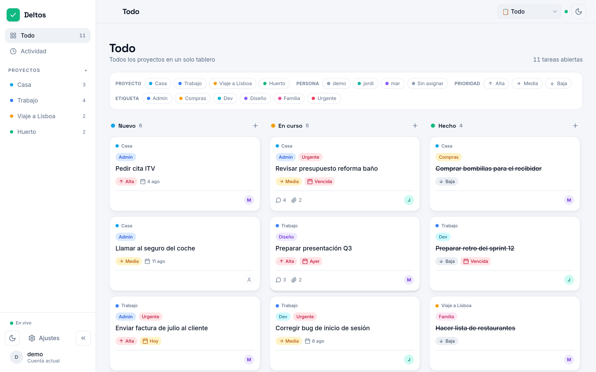
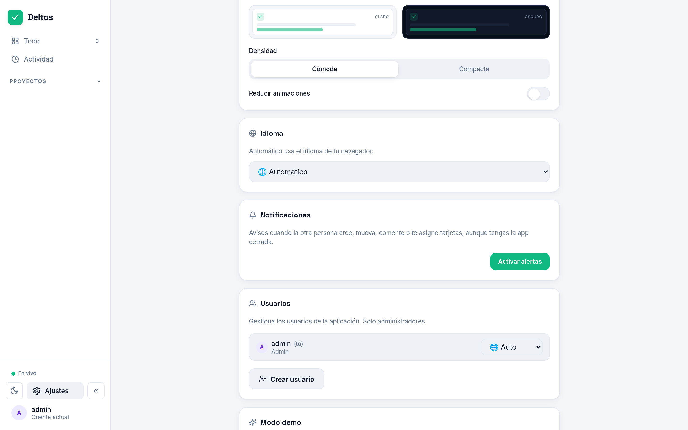

# Deltos

<p align="center">
  <a href="README.md">English</a> |
  <a href="README.es.md">Español</a>
</p>

<p align="center">
  <a href="https://github.com/gnacho/deltos/releases"></a>
  <a href="https://github.com/gnacho/deltos/actions/workflows/release.yml"></a>
  <a href="LICENSE"></a>
</p>

<p align="center">
  <picture>
    <source media="(prefers-color-scheme: dark)" srcset="assets/hero-dark.png">
    <source media="(prefers-color-scheme: light)" srcset="assets/hero-light.png">
    
  </picture>
</p>

Deltos es una PWA de tareas en pareja: un tablero kanban compartido con
sincronización en vivo, comentarios, adjuntos y notificaciones push, servido
por un único servicio Node + SQLite. Sin cuentas, sin nube, sin Docker.

## ¿Por qué existe?

Todas las apps de tareas en pareja que probamos pedían cuenta, suscripción o
las dos cosas — y nuestras listas compartidas acababan en el servidor de
otro, detrás de un login que no controlamos. Con una mudanza en camino,
quería un tablero que mi pareja y yo pudiéramos abrir desde la red de casa,
instalar como app y olvidarnos de él. Deltos es eso: un servicio Node con
SQLite, corriendo en un contenedor de casa desde agosto de 2026. Hace menos
que Trello, y esa es la idea.

## Características

- **Kanban compartido** — columnas Nuevo / En curso / Hecho con arrastrar y
  soltar, en vivo entre sesiones vía SSE (sin recargar, sin polling).
- **Notificaciones push** — Web Push (VAPID) cuando la otra persona crea,
  mueve, comenta o te asigna una tarjeta, aunque tengas la app cerrada.
  Dormido en HTTP plano; se activa solo cuando la app se sirve por HTTPS.
- **Tarjetas con todo** — comentarios, adjuntos con visor de imágenes en la
  app, etiquetas, prioridad, vencimiento y feed de actividad por tarjeta.
- **Multiusuario** — roles admin/user, idioma por usuario (ES/EN), contraseñas
  bcrypt, login con rate-limit y registro de auditoría.
- **PWA instalable** — tema claro/oscuro siguiendo al sistema, service worker
  offline y «comprobar actualizaciones» contra GitHub releases desde Ajustes.
- **Modo demo de un clic** — base de datos separada con datos de muestra, sin
  contraseña; desactivable en Ajustes.
- **Almacenamiento SQLite** — modo WAL, un único fichero en `/var/lib/deltos`.

## Capturas

**Detalle de tarjeta — pestañas de detalles, adjuntos, comentarios y actividad**

<picture>
  <source media="(prefers-color-scheme: dark)" srcset="assets/screenshot-task-dark.png">
  <source media="(prefers-color-scheme: light)" srcset="assets/screenshot-task-light.png">
  
</picture>

**Ajustes — perfil, apariencia, idioma, notificaciones con botón de activar alertas, usuarios**

<picture>
  <source media="(prefers-color-scheme: dark)" srcset="assets/screenshot-settings-dark.png">
  <source media="(prefers-color-scheme: light)" srcset="assets/screenshot-settings-light.png">
  
</picture>

## Instalación

Requisitos: Linux (x86_64 o arm64) con systemd, acceso root o sudo.

```sh
curl -fsSL https://raw.githubusercontent.com/gnacho/deltos/main/install.sh | sudo sh   # (recomendado)
```

El instalador es un script POSIX shell legible y sin dependencias —
[inspecciónalo antes de ejecutarlo](install.sh), para eso se mantiene
simple. Detecta tu distro/arquitectura, descarga la última release y
**verifica su checksum SHA-256**, instala un runtime Node versionado y la
app en `/opt/deltos`, crea un servicio systemd `deltos` sandboxed y muestra
la contraseña inicial de admin una sola vez.

Ejecutar el mismo comando más adelante actualiza a la última release.
Para desinstalar: `curl -fsSL https://raw.githubusercontent.com/gnacho/deltos/main/install.sh | sudo sh -s -- --uninstall`.

<details>
<summary><strong>Docker</strong></summary>

```bash
docker build -t deltos .
docker run -d --name deltos -p 3000:3000 \
  -e AUTH_USER=admin -e AUTH_PASS='usa-una-password-fuerte' \
  -v deltos-data:/app/data \
  deltos
```

Imagen multi-stage `node:22-slim`: `npm ci --omit=dev` para el servidor +
`server/` + `app/dist/`. Monta un volumen en `/app/data` (SQLite + uploads).
El fichero `.env` no se copia a la imagen: todo viene de los defaults +
entorno del contenedor.

</details>

<details>
<summary><strong>Instalación manual (desde tarball de release)</strong></summary>

Descarga el artefacto de tu arquitectura desde
[Releases](https://github.com/gnacho/deltos/releases/latest) y verifícalo
contra `checksums.txt` (`sha256sum -c checksums.txt --ignore-missing`).
Las releases se publican por tag `v*` con `node_modules` precompilado por
arquitectura (`.github/workflows/release.yml`) — no hace falta compilador
en el servidor.

</details>

## Configuración

El servicio lee su entorno (instalador: `/etc/deltos/env`):

| Variable            | Defecto                 | Descripción |
| ------------------- | ----------------------- | ----------- |
| `PORT`              | `3000`                  | Puerto de escucha (tras Nginx Proxy Manager). |
| `DATA_DIR`          | `/var/lib/deltos`       | Ficheros SQLite + uploads. |
| `STATIC_DIR`        | `app/dist`              | Frontend compilado a servir. |
| `AUTH_USER`/`AUTH_PASS` | —                   | Admin bootstrap en el primer arranque (idempotente). |
| `COOKIE_SECURE`     | `false`                 | `true` solo tras HTTPS. |
| `SESSION_SECRET`    | autogenerado            | Secreto HMAC; persistido en la BD si no se define. |
| `MAX_SSE_CLIENTS`   | `20`                    | Clientes de sincronización en vivo concurrentes. |
| `MAX_UPLOAD_MB`     | `10`                    | Límite de tamaño de adjuntos. |
| `VAPID_PUBLIC_KEY` / `VAPID_PRIVATE_KEY` / `VAPID_SUBJECT` | — | Claves Web Push (las tres o ninguna). Se generan con `npx web-push generate-vapid-keys --json`; el subject debe ser un `mailto:`. Sin ellas el push queda apagado y la app funciona igual. |

Reinicia tras cambios: `sudo systemctl restart deltos`.

## Credenciales

- **Producción**: el primer arranque crea el admin desde `AUTH_USER` /
  `AUTH_PASS` (si falta `AUTH_PASS`, no se crea admin y se registra un aviso).
- **Demo**: botón «Entrar como demo» en la pantalla de login (sin contraseña).
  Base de datos demo separada (`app_demo.db`), sembrada con 3 usuarios,
  4 proyectos, 6 etiquetas y 15 tareas. Desactivable en Ajustes (solo admin).

## Desarrollo

Stack: **Node 22 + Hono + better-sqlite3 (backend) · React 19 + Vite +
Tailwind (frontend)**.

```bash
# Backend (puerto 3000 por defecto; ver server/.env.example)
cd server
npm ci
cp .env.example .env   # ajusta AUTH_USER / AUTH_PASS
npm run dev

# Frontend (otra terminal, con proxy al backend en dev)
cd app
npm ci
npm run dev

# Build de producción del frontend (lo sirve el propio backend)
npm run build
```

Con `npm run build` hecho, el backend basta: sirve la SPA desde `app/dist`
con fallback SPA.

## Tests

```bash
cd server && npm test          # vitest: 50 tests de API/auth/push/adjuntos
```

## Licencia

[AGPL-3.0](LICENSE)
