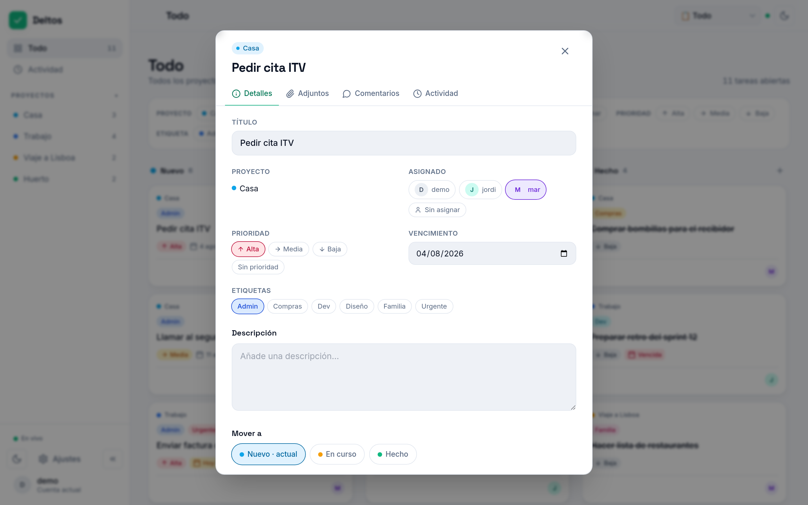

# Deltos

<p align="center">
  <a href="README.md">English</a> |
  <a href="README.es.md">Español</a>
</p>

<p align="center">
  <a href="https://github.com/gnacho/deltos/releases"></a>
  <a href="https://github.com/gnacho/deltos/actions/workflows/release.yml"></a>
  <a href="LICENSE"></a>
</p>

<p align="center">
  <picture>
    <source media="(prefers-color-scheme: dark)" srcset="assets/hero-es-dark.png">
    <source media="(prefers-color-scheme: light)" srcset="assets/hero-es-light.png">
    
  </picture>
</p>

Deltos es una PWA de gestión de tareas para el día a día: un tablero kanban
compartido con sincronización en vivo, comentarios, adjuntos y notificaciones
push, servido por un único servicio Node + SQLite. Vale para una pareja, una
familia, un grupo de amigos organizando un viaje o un equipo pequeño, sin la
complejidad de las herramientas grandes y sin tus datos en la nube de otro.

## ¿Por qué existe?

Deltos nació como el tablero de un viaje con amigos: seis personas, una hoja
de cálculo que nadie actualizaba y un chat donde cada decisión se perdía.
Luego lo seguimos usando en casa para lo cotidiano, y otra vez durante una
reforma y la mudanza que vino detrás. Todo lo que habíamos probado pedía
cuenta y suscripción, guardaba nuestras listas en el servidor de otro, o
traía más proceso del que una familia necesita. Así que construí lo pequeño:
un servicio, un único fichero de base de datos y un tablero que se sincroniza
en vivo. Hace menos que Trello o Jira, y para nosotros esa era la idea.

## ¿Por qué este stack?

- **Node 22 + Hono + better-sqlite3**: la app es sobre todo E/S: sync en
  vivo por SSE, subida de adjuntos, unos pocos usuarios concurrentes. El
  bucle de eventos de Node encaja en esa forma y Hono aporta rutas sin
  impuesto de framework.
- **SQLite, sin base de datos externa**: un fichero en `/var/lib/deltos`,
  modo WAL; un backup es copiar un archivo. Nada que administrar para unos
  pocos usuarios.
- **systemd tras Nginx Proxy Manager, sin Docker**: corre en un LXC pequeño
  en casa; menos capas, logs en journald y una actualización es mover un
  symlink (Docker sigue disponible como alternativa, ver Instalación).
- **React 19 + Vite + Tailwind**: la shell de UI (sidebar, temas, i18n,
  ajustes) es compartida con mis otras apps, así que un arreglo llega a
  todas a la vez.

## Características

- **Kanban compartido**: columnas Nuevo / En curso / Hecho con arrastrar y
  soltar, en vivo entre sesiones vía SSE (sin recargar, sin polling).
- **Notificaciones push**: Web Push (VAPID) cuando alguien crea, mueve,
  comenta o te asigna una tarjeta, incluso con la app cerrada. Dormido en
  HTTP plano; se activa solo cuando la app se sirve por HTTPS.
- **Tarjetas con todo**: comentarios, adjuntos con visor de imágenes en la
  app, etiquetas, prioridad, vencimiento y feed de actividad por tarjeta.
- **Multiusuario**: roles admin/usuario, idioma por usuario (ES/EN),
  contraseñas bcrypt, login con rate-limit y registro de auditoría.
- **PWA instalable**: tema claro/oscuro siguiendo al sistema, service
  worker offline y "comprobar actualizaciones" contra GitHub releases desde
  Ajustes.
- **Modo demo con un clic**: base de datos sembrada aparte, sin contraseña;
  desactivable en Ajustes.
- **Almacenamiento SQLite**: modo WAL, un único fichero en `/var/lib/deltos`.

## Capturas

**Detalle de tarjeta:** pestañas de detalles, adjuntos, comentarios y actividad**

<picture>
  <source media="(prefers-color-scheme: dark)" srcset="assets/screenshot-task-es-dark.png">
  <source media="(prefers-color-scheme: light)" srcset="assets/screenshot-task-es-light.png">
  
</picture>

**Ajustes:** apariencia con color de acento, perfil, etiquetas, idioma**

<picture>
  <source media="(prefers-color-scheme: dark)" srcset="assets/screenshot-settings-es-dark.png">
  <source media="(prefers-color-scheme: light)" srcset="assets/screenshot-settings-es-light.png">
  
</picture>

## Instalación

Requisitos: Linux (x86_64 o arm64) con systemd, acceso root o sudo.

```sh
curl -fsSL https://raw.githubusercontent.com/gnacho/deltos/main/install.sh | sudo sh   # (recomendado)
```

El instalador es un script POSIX shell legible y sin dependencias.
[Inspecciónalo antes de ejecutarlo](install.sh): para eso se mantiene
simple. Detecta tu distro/arquitectura, descarga la última release y
**verifica su checksum SHA-256**, instala un runtime Node versionado y la
app en `/opt/deltos`, crea un servicio systemd `deltos` enjaulado y muestra
la contraseña inicial de admin una sola vez.

Ejecutar el mismo comando más adelante actualiza a la última release.
Para desinstalar: `curl -fsSL https://raw.githubusercontent.com/gnacho/deltos/main/install.sh | sudo sh -s -- --uninstall`.

<details>
<summary><strong>Docker</strong></summary>

```bash
docker build -t deltos .
docker run -d --name deltos -p 3000:3000 \
  -e AUTH_USER=admin -e AUTH_PASS='usa-una-contraseña-fuerte' \
  -v deltos-data:/app/data \
  deltos
```

Imagen multi-stage `node:24-slim`: `npm ci --omit=dev` para el server +
`server/` + `app/dist/`. Monta un volumen en `/app/data` (SQLite + uploads).
El `.env` no se copia a la imagen: todo viene de defaults + entorno del
contenedor.

</details>

<details>
<summary><strong>Instalación manual (desde tarball de release)</strong></summary>

Descarga el artefacto de tu arquitectura desde
[Releases](https://github.com/gnacho/deltos/releases/latest) y verifícalo
contra `checksums.txt` (`sha256sum -c checksums.txt --ignore-missing`).
Las releases se publican por tag `v*` con `node_modules` precompilado por
arquitectura (`.github/workflows/release.yml`); no hace falta compilador
en el servidor.

</details>

## Configuración

El servicio lee su entorno (instalador: `/etc/deltos/env`):

| Variable            | Default                 | Descripción |
| ------------------- | ----------------------- | ----------- |
| `PORT`              | `3000`                  | Puerto de escucha (tras Nginx Proxy Manager). |
| `DATA_DIR`          | `/var/lib/deltos`       | Ficheros SQLite + uploads. |
| `STATIC_DIR`        | `app/dist`              | Frontend compilado a servir. |
| `AUTH_USER`/`AUTH_PASS` | - | Admin de arranque en el primer boot (idempotente). |
| `COOKIE_SECURE`     | `false`                 | `true` solo tras HTTPS. |
| `SESSION_SECRET`    | auto-generado           | Secreto HMAC; se persiste en la BD si no se define. |
| `MAX_SSE_CLIENTS`   | `20`                    | Clientes de sync en vivo concurrentes. |
| `MAX_UPLOAD_MB`     | `10`                    | Tamaño máximo de adjunto. |
| `VAPID_PUBLIC_KEY` / `VAPID_PRIVATE_KEY` / `VAPID_SUBJECT` | - | Claves Web Push (las tres o ninguna). Genera con `npx web-push generate-vapid-keys --json`; el subject debe ser un `mailto:`. Sin ellas el push queda apagado y la app funciona igual. |

Reinicia tras cambios: `sudo systemctl restart deltos`.

## Credenciales

- **Producción**: el primer boot crea el admin desde `AUTH_USER` /
  `AUTH_PASS` (si falta `AUTH_PASS`, no se crea admin y se registra un
  aviso).
- **Demo**: botón "Entrar como demo" en la pantalla de login (sin
  contraseña). Base de datos demo aparte (`app_demo.db`), sembrada con 3
  usuarios, 4 proyectos, 6 etiquetas y 15 tareas. Desactivable en Ajustes
  (solo admin).

## Desarrollo

Stack: **Node 24 + Hono + better-sqlite3 (backend) · React 19 + Vite +
Tailwind (frontend)**.

```bash
# Backend (puerto 3000 por defecto; ver server/.env.example)
cd server
npm ci
cp .env.example .env   # ajusta AUTH_USER / AUTH_PASS
npm run dev

# Frontend (otro terminal, con proxy al backend en dev)
cd app
npm ci
npm run dev

# Build de producción del frontend (lo sirve el propio backend)
npm run build
```

Con `npm run build` hecho, el backend basta: sirve la SPA desde `app/dist`
con fallback SPA.

## Tests

```bash
cd server && npm test          # vitest: 76 tests de API/auth/push/etiquetas
```

## Licencia

[AGPL-3.0](LICENSE)
