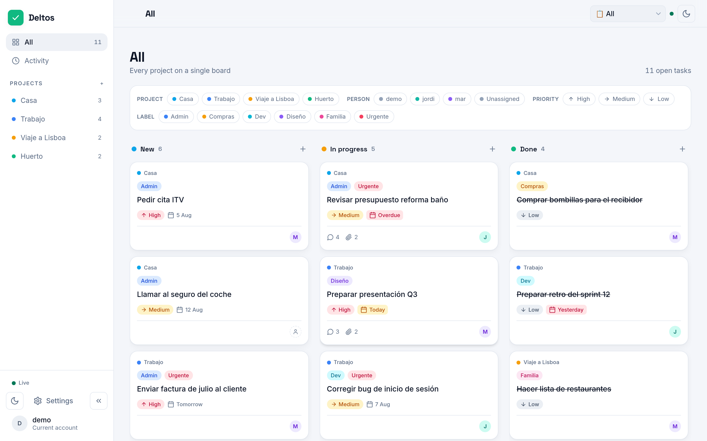
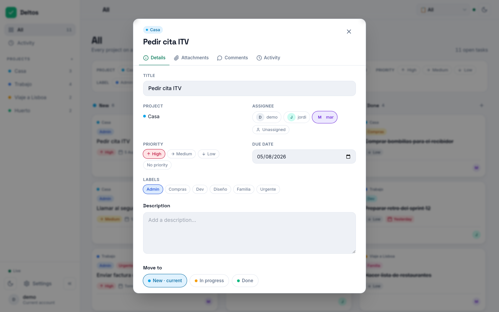
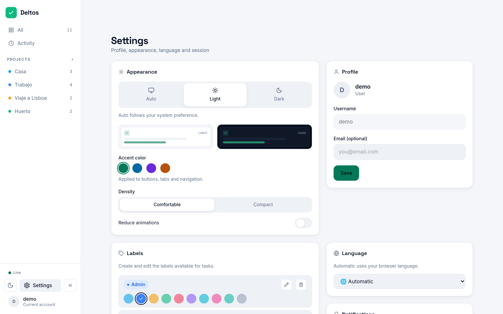

# Deltos

<p align="center">
  <a href="README.md">English</a> |
  <a href="README.es.md">Español</a>
</p>

<p align="center">
  <a href="https://deltos.cloudless.club"></a>
  <a href="https://github.com/gnacho/deltos/releases"></a>
  <a href="https://github.com/gnacho/deltos/actions/workflows/release.yml"></a>
  <a href="LICENSE"></a>
  <a href="https://ko-fi.com/gnacho"></a>
</p>

<p align="center">
  <picture>
    <source media="(prefers-color-scheme: dark)" srcset="assets/hero-en-dark.png">
    <source media="(prefers-color-scheme: light)" srcset="assets/hero-en-light.png">
    
  </picture>
</p>

Deltos is a task-management PWA for everyday life: a shared kanban board with
live sync, comments, attachments and push notifications, served by a single
small Node + SQLite service. It works for a couple, a family, a group of
friends planning a trip, or a small team, without the complexity of the big
tools and without your data on somebody else's cloud.

## The name

Deltos comes from the ancient Greek _δέλτος_ (déltos): a writing tablet, and
by extension any written record or letter. Before paper, that was how you
kept notes on what mattered. The name fit an app whose whole point is writing
tasks down and keeping them where the people who share them can see them.

## Why does this exist?

Deltos started as the board for a friends' trip: six people, a spreadsheet
nobody updated, and a chat where every decision got buried. Then we kept
using it at home for the day-to-day stuff, and again through a renovation
and the move that came with it. Everything we had tried before wanted an
account and a subscription, kept our lists on someone else's server, or
brought more process than a family needs. So I built the small thing: one
service, one file of database, a board that syncs live. It does less than
Trello or Jira, and for us that was the point.

## Why this stack?

- **Node 22 + Hono + better-sqlite3**: the app is mostly I/O: SSE live
  sync, uploads, a handful of concurrent users. Node's event loop fits that
  shape and Hono adds routing without framework tax.
- **SQLite, no external database**: one file under `/var/lib/deltos`, WAL
  mode; a backup is a file copy. Nothing to administer for a few users.
- **systemd behind Nginx Proxy Manager, no Docker**: it runs in a small LXC
  at home; fewer layers, logs in journald, an upgrade is a symlink swap
  (Docker is still available as an alternative, see Installation).
- **React 19 + Vite + Tailwind**: the UI shell (sidebar, themes, i18n,
  settings) is shared with my other apps, so a fix lands everywhere at once.

## Features

- **Shared kanban**: New / In progress / Done columns with drag & drop, live
  between sessions over SSE (no refresh, no polling).
- **Push notifications**: Web Push (VAPID) when someone creates, moves,
  comments on or assigns you a card, even with the app closed. Dormant on
  plain HTTP; turns itself on once the app is served over HTTPS.
- **Cards with everything**: comments, attachments with an in-app image
  viewer, labels, priority, due dates and a per-card activity feed.
- **Multiuser**: admin/user roles, per-user language (ES/EN), bcrypt
  passwords, rate-limited login, audit trail.
- **Installable PWA**: light/dark theme following the system, offline
  service worker, "check for updates" against GitHub releases from Settings.
- **One-click demo mode**: separate seeded database, no password; can be
  disabled in Settings.
- **SQLite storage**: WAL mode, single file under `/var/lib/deltos`.

## Screenshots

**Card detail:** tabs for details, attachments, comments and activity**

<picture>
  <source media="(prefers-color-scheme: dark)" srcset="assets/screenshot-task-en-dark.png">
  <source media="(prefers-color-scheme: light)" srcset="assets/screenshot-task-en-light.png">
  
</picture>

**Settings:** appearance with accent color, profile, labels, language**

<picture>
  <source media="(prefers-color-scheme: dark)" srcset="assets/screenshot-settings-en-dark.png">
  <source media="(prefers-color-scheme: light)" srcset="assets/screenshot-settings-en-light.png">
  
</picture>

## Installation

Requirements: Linux (x86_64 or arm64) with systemd, root or sudo access.

```sh
curl -fsSL https://raw.githubusercontent.com/gnacho/deltos/main/install.sh | sudo sh   # (recommended)
```

The installer is a readable, dependency-free POSIX shell script.
[Inspect it before running](install.sh): that's the point of keeping it
plain. It detects your distro/arch, downloads the latest release and
**verifies its SHA-256 checksum**, installs a versioned Node runtime and the
app under `/opt/deltos`, creates a sandboxed `deltos` systemd service and
prints the initial admin password once.

Running the same command again later upgrades to the latest release.
To uninstall: `curl -fsSL https://raw.githubusercontent.com/gnacho/deltos/main/install.sh | sudo sh -s -- --uninstall`.

<details>
<summary><strong>Docker</strong></summary>

```bash
docker build -t deltos .
docker run -d --name deltos -p 3000:3000 \
  -e AUTH_USER=admin -e AUTH_PASS='use-a-strong-password' \
  -v deltos-data:/app/data \
  deltos
```

Multi-stage `node:24-slim` image: `npm ci --omit=dev` for the server +
`server/` + `app/dist/`. Mount a volume at `/app/data` (SQLite + uploads).
The `.env` file is not copied into the image: everything comes from
defaults + container environment.

</details>

<details>
<summary><strong>Manual installation (from a release tarball)</strong></summary>

Download the artifact for your architecture from
[Releases](https://github.com/gnacho/deltos/releases/latest) and verify it
against `checksums.txt` (`sha256sum -c checksums.txt --ignore-missing`).
Releases are published per `v*` tag with `node_modules` pre-built per arch
(`.github/workflows/release.yml`); no compiler needed on the server.

</details>

## Configuration

The service reads its environment (installer: `/etc/deltos/env`):

| Variable            | Default                 | Description |
| ------------------- | ----------------------- | ----------- |
| `PORT`              | `3000`                  | Listen port (behind Nginx Proxy Manager). |
| `DATA_DIR`          | `/var/lib/deltos`       | SQLite files + uploads. |
| `STATIC_DIR`        | `app/dist`              | Built frontend to serve. |
| `AUTH_USER`/`AUTH_PASS` | - | Bootstrap admin on first boot (idempotent). |
| `COOKIE_SECURE`     | `false`                 | `true` only behind HTTPS. |
| `SESSION_SECRET`    | auto-generated          | HMAC secret; persisted in the DB if unset. |
| `MAX_SSE_CLIENTS`   | `20`                    | Concurrent live-sync clients. |
| `MAX_UPLOAD_MB`     | `10`                    | Attachment size limit. |
| `VAPID_PUBLIC_KEY` / `VAPID_PRIVATE_KEY` / `VAPID_SUBJECT` | - | Web Push keys (all three or none). Generate with `npx web-push generate-vapid-keys --json`; subject must be a `mailto:`. Without them, push stays off and the app runs fine. |

Restart after changes: `sudo systemctl restart deltos`.

## Credentials

- **Production**: first boot creates the admin from `AUTH_USER` / `AUTH_PASS`
  (if `AUTH_PASS` is missing, no admin is created and a warning is logged).
- **Demo**: "Sign in as demo" button on the login screen (no password).
  Separate demo database (`app_demo.db`), seeded with 3 users, 4 projects,
  6 labels and 15 tasks. Can be disabled in Settings (admin only).

## Development

Stack: **Node 24 + Hono + better-sqlite3 (backend) · React 19 + Vite +
Tailwind (frontend)**.

```bash
# Backend (port 3000 by default; see server/.env.example)
cd server
npm ci
cp .env.example .env   # adjust AUTH_USER / AUTH_PASS
npm run dev

# Frontend (another terminal, proxied to the backend in dev)
cd app
npm ci
npm run dev

# Production frontend build (served by the backend itself)
npm run build
```

With `npm run build` done, the backend alone is enough: it serves the SPA
from `app/dist` with SPA fallback.

## Tests

```bash
cd server && npm test          # vitest: 76 API/auth/push/label tests
```

## License

[AGPL-3.0](LICENSE)
